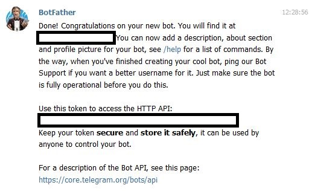

# How to send automated messages to a Telegram group?

1. Create a Grout in Telegram <br>
2. Search in Telegram for --> "BotFather" --> send any text to BotFather --> now select "new bot" (choose a Bot name and a username you like) --> Copy the token created by the bot from the field "Use this token to access the HTTP API" (see pic below)


3. URL for the chat ID: https://api.telegram.org/botPLACE_HERE_THE_TOKEN/getUpdates --> now open this in a browser and copy the "Chat ID" (e.g. "-584738495") 


If you now open this URL (place there your token) in a browser a message to the Telegram Group will be send automatically

# https://api.telegram.org/botPLACE_HERE_THE_TOKEN/sendMessage?chat_id=-530836315&text="This is a test!"


```python
import requests
import time
```


```python
#sentences you want to be automatically send to the Telegram Group

sentences = ["How do you throw a space party? You planet!",
            "How does a rabbi make coffee? Hebrews it!",
            "Want to hear a construction joke? Oh never mind, I’m still working on that one.",
            "Why don’t scientists trust atoms? Because they make up everything!",
            "I hate Russian dolls… they're so full of themselves!",
            "What are shark’s two most favorite words? Man overboard!"]
```


```python
sentences
```


```python
# place in the url the token and your ID - DONE!

for sentence in sentences:
    url = 'https://api.telegram.org/botPLACE_HERE_THE_TOKEN/sendMessage?chat_id=PLACE_HERE_THE_ID&text="{}"'.format(sentence)
    print(url)
    requests.get(url)
    time.sleep(15) #send every x seconds
    
    
    
    
    
```
